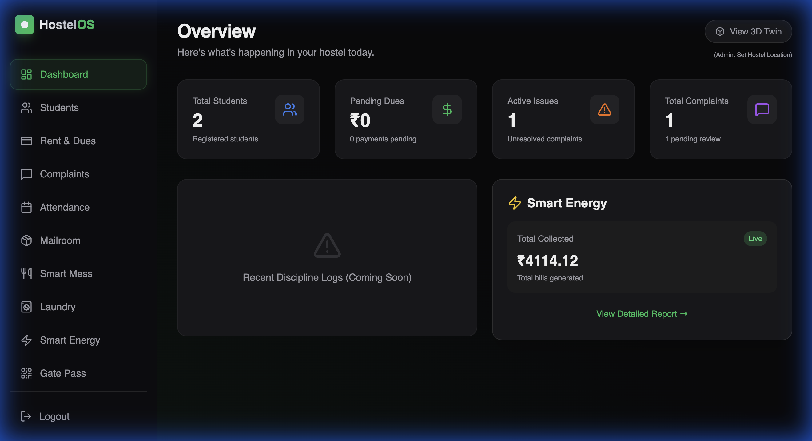
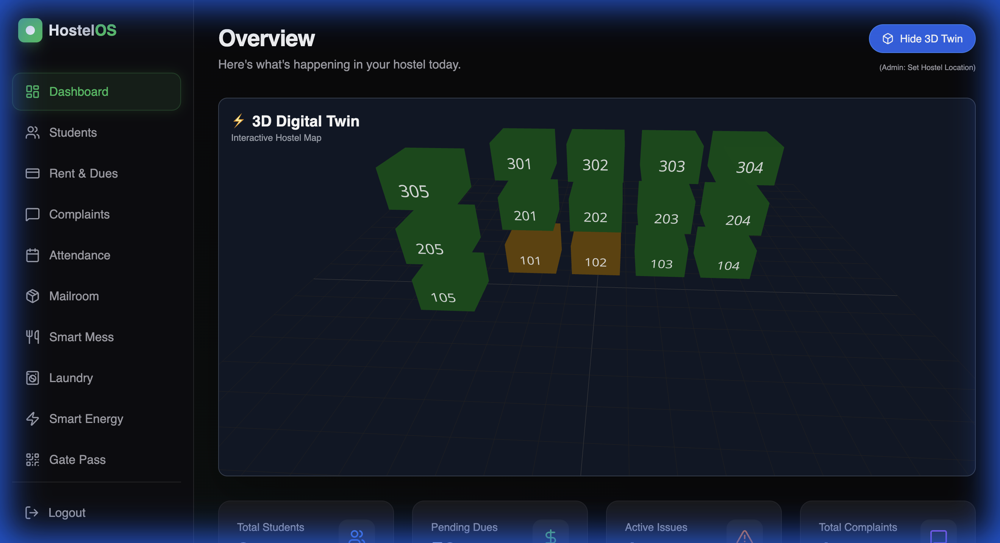
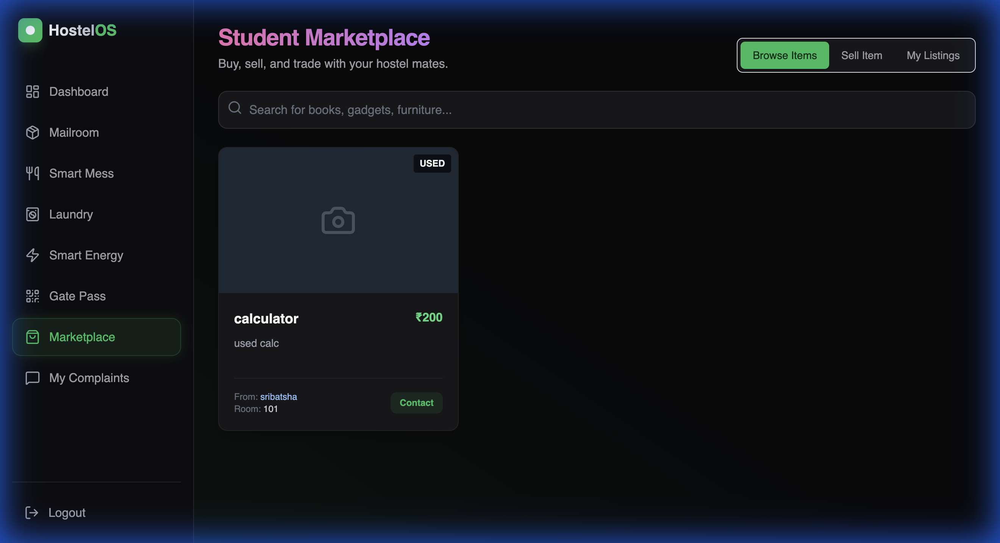

# 🏨 HostelOS
> **The Future of Hostel Management.**


**HostelOS** upgrades the traditional hostel experience into a high-tech, digital ecosystem. From **3D Digital Twins** of the building to a student-run **Marketplace**, we automate the boring stuff so you can focus on the living.

---

## ✨ Visual Tour

### 🖥️ Admin Dashboard
*Real-time overview of occupancy, energy, and issues.*


### 🌍 3D Digital Twin
*Interactive, real-time visualization of hostel rooms and occupancy.*


### 🛍️ Student Marketplace
*A private, safe economy for students to buy and sell items.*


---

## 🚀 Key Features

*   **🌍 3D Digital Twin**: Navigate your hostel like a video game. See room status (Red/Yellow/Green) in real-time.
*   **🛍️ Student Marketplace**: A specialized platform for students to sell books, gadgets, and furniture. **Students Only!**
*   **🤖 AI Face Mess System**: Futuristic dining access using Face ID simulation and credit tracking.
*   **📍 Smart Attendance**: Geolocation-based check-ins. No more long queues for attendance.
*   **� Digital Mailroom**: Secure package tracking. Get a PIN, show it, take your parcel.
*   **⚡ IoT Energy Monitoring**: Track simulated electricity usage per room and find power hogs.
*   **🎟️ Digital Gate Pass**: QR-code based exit and entry logs.

---

## 🛠️ The Tech Stack

*   **Frontend**: React 18, Vite, TailwindCSS, Lucide Icons, Recharts, React Three Fiber.
*   **Backend**: FastAPI (Python), SQLAlchemy, SQLite.
*   **Architecture**: Modular REST API with Role-Based Access Control (RBAC).

---

## ⚡ Quick Start Guide

### 1. Backend Setup
```bash
cd backend
python -m venv venv
source venv/bin/activate  # Windows: venv\Scripts\activate
pip install -r requirements.txt

# Initialize Database
python migrate_db.py
python migrate_parcels.py
python migrate_marketplace.py 
# (Run other migrate scripts as needed)

uvicorn main:app --reload
```

### 2. Frontend Setup
```bash
cd frontend
npm install
npm run dev
```

---

## � Demo Credentials

| Portal | Username / Phone | Password |
| :--- | :--- | :--- |
| **Admin** | `admin` | `admin` |
| **Student** | `9328994892` | `9328994892` |

---

*Built with ❤️ for the Entupr Hackathon.*
